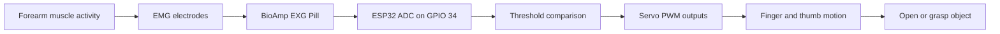

# Signal Flow

## Signal Path Explanation

The BioAmp EXG Pill captures the EMG signal from the forearm. The ESP32 reads the analog value, compares it with a threshold, and drives the servos to either open or close the hand.
