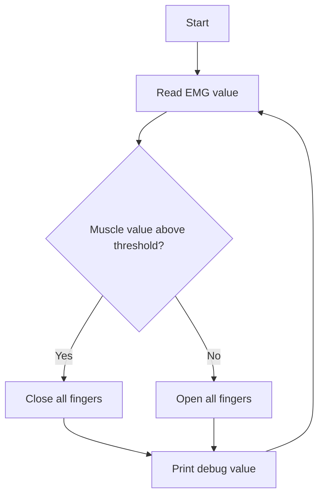

# System Flowchart

## Control Summary

- Above threshold = flex = close fist
- Below threshold = relaxed = open hand

This simple binary model is a good first control strategy for a prosthetic hand prototype.
