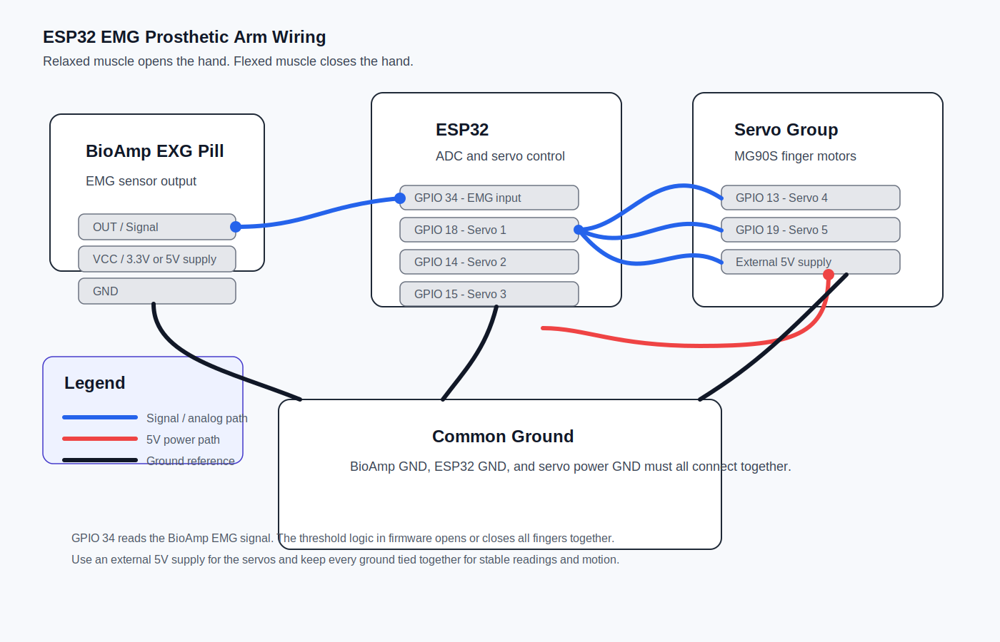
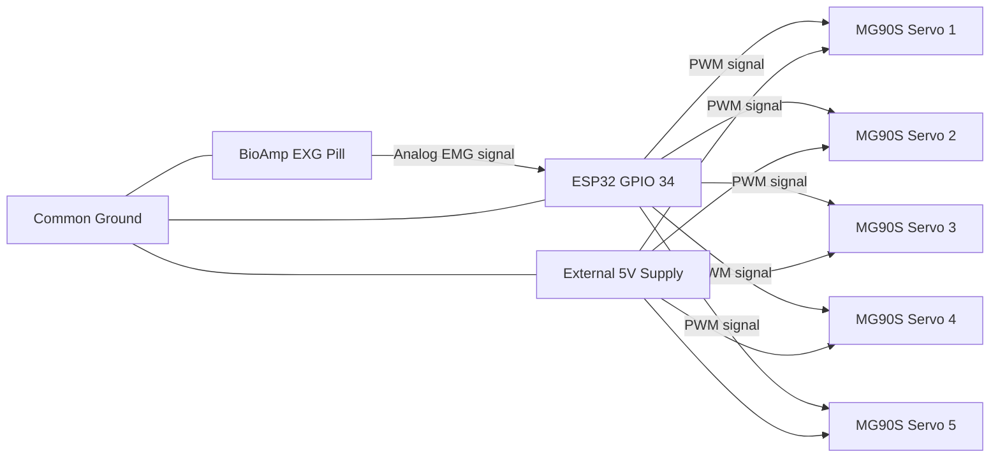

# Wiring Diagram

The diagram below shows the basic electrical relationships in the project. It was built from the project pin map and the general wiring guidance in the Upside Down Labs BioAmp EXG Pill repository, which shows EMG signal acquisition through the BioAmp output and a common-ground setup for safe analog interfacing.

## Important Wiring Notes

- BioAmp output goes to `GPIO 34`.
- Servo signal pins are `18`, `14`, `15`, `13`, and `19`.
- Servo power should come from an external 5V source.
- All ground lines must be connected together.
- BioAmp EXG Pill is used as an analog EMG source into the ESP32 ADC path.

## Wiring Summary Table

| Component | Connection |
|---|---|
| BioAmp EXG Pill OUT | ESP32 GPIO 34 |
| BioAmp EXG Pill GND | Common GND |
| Servo 1 signal | GPIO 18 |
| Servo 2 signal | GPIO 14 |
| Servo 3 signal | GPIO 15 |
| Servo 4 signal | GPIO 13 |
| Servo 5 signal | GPIO 19 |
| Servo VCC | External 5V |
| Servo GND | Common GND |

For the full pin map, see [hardware/pin_connections.md](../hardware/pin_connections.md).

Source reference:

- Upside Down Labs BioAmp EXG Pill README: `upsidedownlabs/BioAmp-EXG-Pill`
- Upside Down Labs Servo Control example: `upsidedownlabs/Muscle-BioAmp-Arduino-Firmware`
